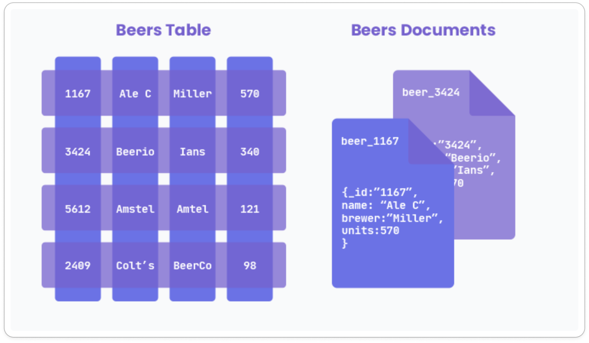
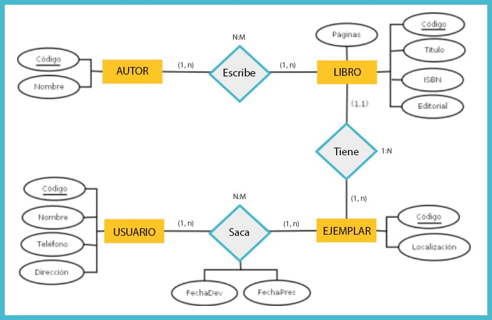
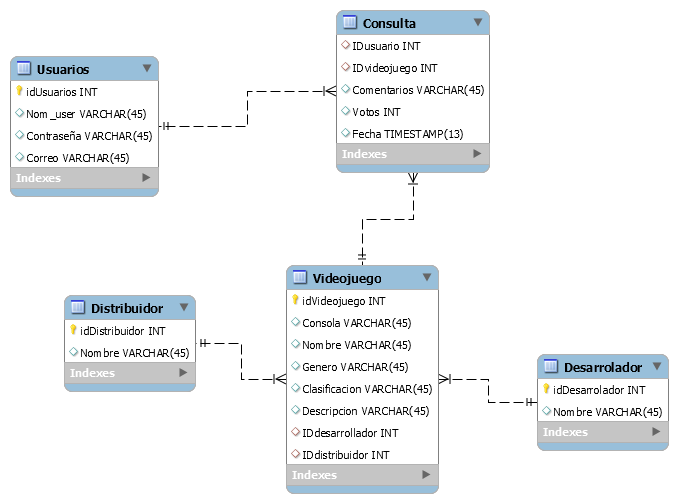
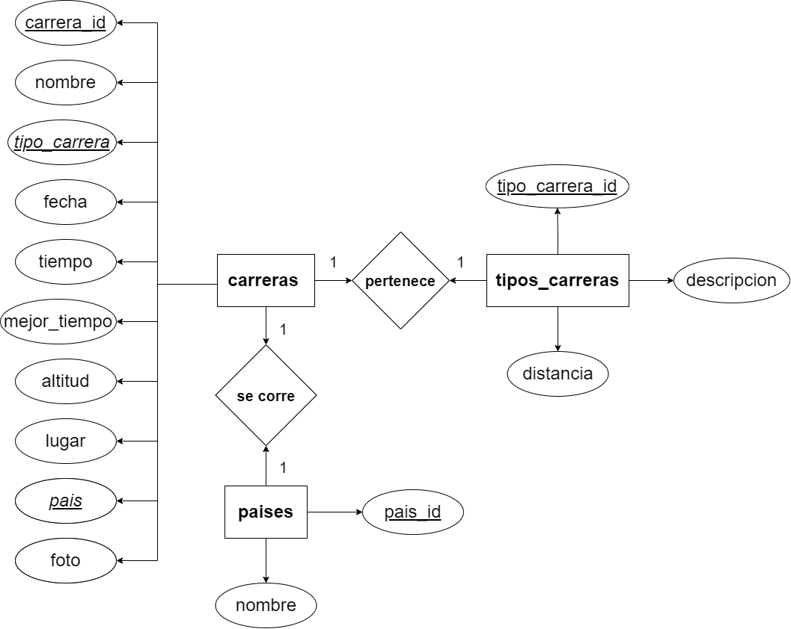
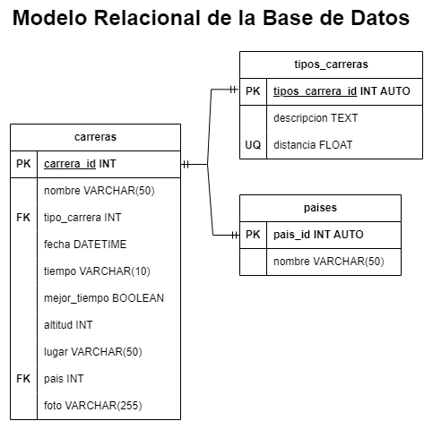

# Curso Diseño de Bases de Datos - jonmircha

### Conceptos Básicos

- Datos.-
    - Son una unidad singular de conocimiento.
    - Por si solos no tienen un significado hasta que son utilizados en la información para dar un contexto.
- Información.-
    - Conjunto organizado de datos relevantes para uno o más sujetos que extraen de él un conocimiento.
- Sistema Gestor de Base de Datos / Database Management System.-
    - Estos nos permitirán administrar toda la información almacenada en nuestras bases de datos.
    - Estos nos darán a su vez mayor seguridad a nuestra información.
    - Garantizaran la integridad de los datos.
    - Los podemos clasificar en 2 grandes grupos, los sistemas gestores relacionales (SQL) y los sistemas gestores no relacionales (NoSQL).

### Tipos de Bases de Datos

- Una mala elección de el tipo de base de datos puede generar problemas interminables durante el desarrollo de nuestras aplicaciones.
- **Relacionales.- (SQL)**
    - Colecciones ordenadas de registros que se organizaran en un conjunto de tablas.
    - Una tabla es el elemento principal en este tipo de bases de datos.
    - Los registros de información se van a organizar en columnas y filas.
    - Las tablas se van a relacionar entre si.
    - Para acceder a los datos utilizamos al lenguaje de consulta estructurada (SQL) Structure Query Language.
    - Podremos obtener y alterar los datos de una forma organizada, siempre y cuando tengamos en cuenta cual es la estructura de base de datos que estamos trabajando.
    - Utilizaremos distintos comandos que SQL nos pone a disposición para trabajar con los datos que contiene nuestra DB.
    - Cada tabla y dato tendrán identificadores únicos.
    - Ejemplos Sistemas Gestores de DB:
        - MySQL.-
        - MariaDB.-
        - PostgreSQL.-
        - SQL Server Microsoft.-
        - Oracle.-
    - Dependiendo de la complejidad de la query y la cantidad de datos consultados las consultas pueden durar incluso minutos.
- **No Relacionales.- (NoSQL)**
    - Estan diseñadas para modelar datos con estructuras un poco mas especificas y que no necesiten estar relacionados los datos entre si.
    - Cada entidad funciona de forma independiente y son mas sencillas de usar que las DB relacionales.
    - En el bigdata se utilizan mucho las bases de datos no relacionales, podemos tener datos duplicados datos.
    - Se mejora el rendimiento y se prioriza el acceso por sobre la normalización y la integridad de los datos.
    - Se ahorra poder de computo para poder procesar la mayor cantidad de datos en el menor tiempo posible a comparación de las SQL.
    - La estructura mas popular utilizada es la de un documento, **clave : valor**.
    - Tenemos bases de datos documentales, llave/valor, grafos.
    - Ejemplos Sistemas Gestores de DB:
        - MongoDB.-
        - Reddis.-
        - Apache Cassandra.-
        - FireBase (Maneja 2 bases de datos).-
- **Comparativa.-**

### Cuando usar SQL y cuando NoSQL?

- Ambos tipos de bases datos son útiles, y dependerá del tipo de aplicación que queramos realizar la elección de una u otra.
    - Por ejemplo queremos desarrollar una aplicación de tipo contable, inventario de productos, información de clientes, lo mas probable es que el mejor modelo que se adapte sea el Relacional (SQL) ya que en este tipo de aplicaciones es muy normal que haya mas de una tabla que tenga relación con el resto.
    - Por el contrario si nuestra aplicación necesita de un sistema en el que los datos se vayan almacenar y no necesiten relacionarse unos con otros y además no tenemos la certeza de que todos los datos tengan la misma estructura, deberemos de usar una base de datos no relacional (NoSQL)
        - Por ejemplo puede ser una base de datos en la que solo queramos almacenar las estadísticas de comportamiento de un usuario al visitar un sitio o una base de datos para recolectar sus datos biométricos esta información puede cambiar de una persona a otra, dependiendo de sus dinámicas con el sitio o de su estado de salud y su condición física para los biométricos.
        - Otro caso seria la creación de una galería de fotos en Facebook o en Instagram, cada usuario puede subir la cantidad de fotos que guste sin que exista una estructura determinada, por ejemplo en Instagram nos permite subir hasta 10 fotos en una sola subida, pero si queremos subir solo 5 fotos, pues solo se suben 5, no estoy obligado a forzosamente en cada galería subir 10 si no las que quieras respetando ese limite.
        - Las estadísticas del progreso de una partida de videojuegos también seria un buen ejemplo de modelo no relacional, ya que la información de un jugador va a variar de la de otro.
- La elección de base de datos es muy importante y no es algo que deba tomarse a la ligera. Por ende la elección errónea de un Sistema Gestor de DB nos puede traer errores fatales durante el desarrollo.
- Aquí hay algunas consideraciones que puedes tener en cuenta al elegir entre un modelo de base de datos *SQL* y *NoSQL*:
    
    ***SQL***
    
    - **Relaciones estructuradas**: Si tu aplicación depende de relaciones estructuradas y complejas entre tus datos, es posible que desees considerar una base de datos *SQL*. Ya que permiten modelar relaciones complejas entre sus tablas y utilizar lenguajes de consulta estandarizados para realizar consultas complejas.
    - **Datos estructurados**: Si tus datos tienen una estructura bien definida y poco probable que cambie con frecuencia, una base de datos *SQL* es una buena opción, ya que permiten definir esquemas rigurosos que garantizan la integridad de los datos y evitan la introducción de datos erróneos o inconsistentes.
    
    **NoSQL**
    
    - **Escalabilidad**: Si tu aplicación está destinada a crecer rápidamente y manejar una gran cantidad de datos, es posible que desees considerar una base de datos *NoSQL*. Estas son más escalables que las bases de datos *SQL* y se adaptan mejor a grandes cantidades de datos no estructurados.
    - **Datos no estructurados**: Si tus datos no tienen una estructura bien definida o cambian con frecuencia, es posible que desees considerar una base de datos *NoSQL*. Estas son más flexibles que las bases de datos *SQL* y te permiten modelar tus datos de manera más natural.
    - **Aplicaciones en tiempo real**: Si tu aplicación requiere una respuesta rápida y en tiempo real, es posible que desees considerar una base de datos *NoSQL*. Estas suelen ser más eficientes que las bases de datos *SQL* en términos de rendimiento y escalabilidad en aplicaciones en tiempo real.
- En última instancia, la elección entre un modelo de base de datos *SQL* o *NoSQL* depende de las necesidades específicas de tu aplicación y de la naturaleza de tus datos. Es importante evaluar cuidadosamente tus requisitos y considerar las  fortalezas y debilidades de cada opción antes de tomar una decisión.

### Entidades y Atributos

Una **entidad** es un objeto del mundo real que se pretende controlar dentro del sistema, por ejemplo: una persona, un producto, una cuenta, un servicio, una empresa, una compra, etc.

Las entidades al ser objetos, van a tener características que las describen, a estas propiedades se les llama **atributos** de la entidad.

Por ejemplo la entidad persona tiene atributos tales como: nombre, apellidos, fecha de nacimiento, domicilio, teléfono, correo, etc.

Lo primero que tenemos que hacer al diseñar una base de datos es hacer un listado de las entidades que se verán involucradas en el sistema y de sus atributos.

- **Tipos de Entidades**
    
    Principalmente son 3.-
    
    - De datos.-
    - Catálogos.-
    - Pivotes.-
    
    ### **De Datos**
    
    Las entidades de datos son aquellas que alimentan el sistema de información. En ellas se almacenan y se interactúa con los datos.
    
    ### **Catálogos**
    
    Los catálogos son entidades que sus registros son una lista o relación ordenada con algún criterio y por tal motivo su información debe estar precargada en el sistema, antes de comenzar a introducir información en el.
    
    Una lista de códigos postales, colonias, municipios, ciudades o países son un buen ejemplo de entidades catalogo.
    
    ### **Pivotes**
    
    Las entidades pivotes son las que **relacionan** la información de 2 o más entidades. Nos ayudan a mantener consistencia e integridad en el sistema y evitan la duplicidad de datos. También suelen llamarse entidades de enlace o asociación.
    
    Por ejemplo en el proceso de una venta, una entidad pivote puede almacenar la relación de qué y cuántos productos se adquirieron en dicha venta, además de relacionar dichos productos con la información del cliente que los compró.
    
- **Atributos:** A nivel de programación los atributos se convierten a los **TIPOS de DATOS.-**
    
    En las bases de datos existen varios tipos de datos que se pueden almacenar y manejar. Algunos de los tipos de datos más comunes incluyen:
    
    - **Números enteros**: se utilizan para almacenar números enteros, como por ejemplo, edad, cantidad de productos, etc.
    - **Números de punto flotante**: se utilizan para almacenar números con decimales, como por ejemplo, precios, coordenadas, etc.
    - **Cadenas de texto**: se utilizan para almacenar caracteres y texto, como por ejemplo, nombres, direcciones, descripciones, etc.
    - **Fechas y horas**: se utilizan para almacenar fechas y horas, como por ejemplo, fechas de nacimiento, fechas de entrega, etc.
    - **Booleanos**: se utilizan para almacenar valores verdaderos o falsos, como por ejemplo, si un usuario está activo o no.
    - ***Blobs* y archivos**: se utilizan para almacenar archivos grandes como imágenes, videos, audio, etc. **NOTA:** En la medida de lo posible debemos evitar almacenar ya sea imágenes o videos en nuestra base de datos ya que consume demasiado poder de computo estarlos consultando, lo ideal es guardar estos archivos en una nube como google drive, one drive, dropbox, etc. Y en nuestra base datos almacenaremos el link de referencia a dichos documentos.
    - **Datos geográficos**: se utilizan para almacenar información geográfica, como por ejemplo, ubicación, direcciones, etc.
    
    Estos son solo algunos ejemplos de los tipos de datos que se pueden almacenar y manejar en una base de datos. El tipo de datos que utilices depende de las necesidades específicas de la aplicación y de la naturaleza de los datos.
    

### CRUD

***CRUD*** es un acrónimo que significa ***Create, Read Update & Delete***, es decir: "Crear, Leer, Actualizar y Eliminar".

Se refiere a las 4 operaciones básicas que se pueden realizar en una base de datos, es decir, la capacidad de crear nuevos registros, leer, actualizar y eliminar los registros existentes.

Estas operaciones se consideran la funcionalidad básica que se espera de cualquier sistema de gestión de bases de datos, y suelen estar implementadas de manera nativa en la mayoría de los *SGBD*.

Estas operaciones se utilizan tanto en la administración de objetos y privilegios de la base de datos como en la gestión de los datos mismos.

### Lógica de Negocio

Es fundamental entender el siguiente concepto de manera teórica, en las bases de datos.

La lógica de negocios es el conjunto de reglas, políticas y procesos que describen cómo se lleva a cabo el negocio.

En el modelado de una base de datos, la lógica de negocios se refiere a la representación de las reglas y procesos de negocios en el modelo de datos.

Estas reglas y procesos incluyen cosas como la validación de los datos, la validación de las restricciones de negocios, la definición de las relaciones entre las entidades, y la definición de cómo se deben calcular ciertos valores.

La incorporación de la lógica de negocios en el modelo de datos es importante porque permite asegurarse de que los datos estén correctamente validados y se respeten las restricciones de negocios antes de ser almacenados en la base de datos.

También permite a los desarrolladores entender mejor cómo los datos se relacionan y se utilizan en un sistema, lo que puede ser útil a la hora de realizar tareas de mantenimiento o mejora.

Además, la lógica de negocios puede ser reutilizada en diferentes partes de la aplicación, lo que reduce el esfuerzo y el tiempo necesarios para implementar la misma lógica en múltiples lugares.

### Llaves

Una llave en bases de datos es un identificador que permite hacer único a un registro de información tenemos 2 tipos: primarias y foráneas.

- **Llave Primaria**
    
    Identifica un registro como único dentro de la entidad a la que pertenece. En nuestro listado de atributos pondremos las siglas ***PK*** de ***Primary Key*** delante del atributo que sea llave principal.
    
- **Llave Foránea**
    
    Relaciona los datos de un registro de una entidad con los de otra, o con un registro distinto de la misma entidad. En nuestro listado de atributos pondremos las siglas ***FK*** de ***Foreign Key*** delante del atributo que sea llave foránea.
    
- **Atributos Únicos**
    
    En algunas ocasiones vamos a necesitar que algunos atributos de la entidad sean **únicos**, es decir que no existan datos duplicados en el atributo, sin que necesariamente sea una llave primaria o foránea.
    
    Esta característica se utiliza a menudo para asegurarse de que los datos sean consistentes y no haya duplicados en la entidad. Por ejemplo para que un usuario no pueda crear 2 cuentas diferentes con un mismo correo o número de teléfono.
    
    Datos que suelen definirse como atributos únicos podrían ser el *DNI*, *email*, teléfono móvil, nombre de usuario o alias, número de placas de un automóvil, etc.
    

### Relaciones

Las relaciones son asociaciones entre entidades que se crean para recuperar y vincular datos.

Para crear una relación semánticamente utiliza un **verbo** para relacionar las entidades en cuestión.

- **Tipos de Relaciones**
    - **1 a 1**: Una persona *(e)* poseé *(r)* una única clave de estudiante *(e)* y viceversa.
    - **1 a M (MUCHOS)**: Una factura *(e)* se emite *(r)* a una persona *(e)* y sólo a una, pero una persona *(e)* puede tener *(r)* varias facturas *(e)* emitidas a su nombre.
    - **M a M (MUCHOS)**: Un cliente *(e)* puede comprar *(r)* varios productos *(e)* y un producto *(e)* puede ser comprado *(r)* por varios clientes *(e)*.
    

### Modelo Entidad-Relacion

Modelo relacional de una biblioteca

Entidades representadas por **rectángulos**, tenemos 4 entidades.

Atributos representados por **ovalos**, cada Entidad tiene sus respectivos atributos.

El atributo subrayado de **Código** representa la llave principal que diferencia de forma única cada registro de la entidad.

Los **rombos** representan de manera similar como si fuese una condicional en los diagramas de flujos en programación, y estos representan la relación que hay entre una entidad y otra

- **Autor**
    - **Código (PK)**
    - Nombre
        - **Escribe** →
- **Libro**
    - Paginas
    - **Código (PK)**
    - Titulo
    - ISBN (Clave única)
    - Editorial
        - ****************Tiene →****************
- **Ejemplar**
    - **Código (PK)**
    - Localización
        - **Saca → (Significa de sacar el libro de la biblioteca)**
            - FechaDev
            - FechaPres
- **Usuario**
    - **Código (PK)**
    - Nombre
    - Teléfono
    - Dirección

Hay una variante a este diagrama, que se llama **Modelo Relacional de la Base de Datos** que también ejemplifica gráficamente la relación de las entidades y la descripción de los atributos de estas.

**NOTA:** Hasta el momento hemos estado llamando entidades a cada tabla (en SQL) o cada documento (en NoSQL) pero en realidad el termino entidades solo se utiliza cuando conceptualmente estas modelando la base de datos, pero dicha ENTIDAD ya se llamara tabla o documento dependiendo del modelo de base de datos en la que estés trabajando.

### Normalización

La normalización de bases de datos es un proceso que se utiliza para organizar y optimizar la estructura de una base de datos para asegurar su integridad, evitar la redundancia y mejorar el rendimiento. La normalización consiste en la división de las entidades en varias entidades más pequeñas y relacionarlas mediante llaves foráneas.

La normalización se realiza a través de varios niveles o formas, cada uno de los cuales representa un grado de descomposición de la entidad original. Los tres niveles más comunes de normalización son la Primera Forma Normal (*1FN*), la Segunda Forma Normal (*2FN*) y la Tercera Forma Normal (*3FN*), aunque existen otros 2 niveles.

El objetivo de la normalización es reducir la redundancia y garantizar la integridad de los datos al asegurar que cada dato solo se almacene en un solo lugar y que los datos sean consistentes y coherentes. La normalización también ayuda a mejorar el rendimiento de la base de datos, ya que reduce el tamaño y la complejidad de las entidades, lo que facilita la indexación y la búsqueda de información.

Es importante tener en cuenta que la normalización puede tener un impacto en el rendimiento de la aplicación, ya que puede requerir una mayor cantidad de consultas y una complejidad adicional para recuperar y manipular datos. Por lo tanto, es importante encontrar un equilibrio entre la normalización y la eficiencia en el diseño de la base de datos.

### **Formas Normales**

Las formas normales son estándares para la organización y modelamiento de datos en una base de datos relacional. En total existen 5 formas normales.

1. **Primera Forma Normal (1FN)**: Cada atributo de una entidad debe contener solo valores atómicos, es decir, valores indivisibles que no pueden ser divididos en atributos más pequeños.
2. **Segunda Forma Normal (2FN)**: Además de cumplir con la *1FN*, cada atributo no dependiente funcionalmente de la llave principal debe estar en una entidad separada.
3. **Tercera Forma Normal (3FN)**: Además de cumplir con la *2FN*, todas las dependencias funcionales deben ser eliminadas, es decir, no deben existir dependencias funcionales transitorias.
4. **Cuarta Forma Normal (4FN)**: También llamada de Forma Normal de *Boyce-Codd* (FNBC), es una forma más restrictiva que la *3FN*, donde se garantiza que no existan dependencias funcionales parciales o transitivas en la entidad.
5. **Quinta Forma Normal (5FN)**: También conocida como Forma Normal de Domino-Clave (FNDC), en ella se debe garantizar que no haya dependencias múltiples de conjuntos en las entidades.

Al aplicar las formas normales a un modelo de base de datos, se puede asegurar que los datos sean consistentes, que no haya redundancia y que sea fácil de mantener y escalar.

Sin embargo, también es importante tener en cuenta que la aplicación de formas normales más rigurosas puede resultar en una estructura de base de datos más compleja y menos eficiente en términos de rendimiento. Por lo tanto, es importante encontrar un equilibrio entre la integridad de los datos y la eficiencia en el diseño de un modelo de base de datos.

************************************Mas información al respecto →************************************ [https://learn.microsoft.com/es-es/office/troubleshoot/access/database-normalization-description#other-normalization-forms](https://learn.microsoft.com/es-es/office/troubleshoot/access/database-normalization-description#other-normalization-forms)

- **Primera Forma Normal**: En la *1FN*, cada columna de una tabla debe contener únicamente valores atómicos, es decir, valores simples que no pueden ser divididos en partes más pequeñas.
- **Segunda Forma Normal**: La *2FN* requiere que cada columna no dependiente funcionalmente de la clave primaria de una tabla sea movida a una tabla separada. Esto significa que cada tabla debe representar un solo hecho o concepto.
- **Tercera Forma Normal**: La *3FN* requiere que todas las dependencias funcionales sean removidas de la tabla, es decir, que no haya redundancia de información.
- **Forma Normal de *Boyce-Codd***: La *FNBC* es una forma normal más rigurosa que la anteriores y requiere que cada dependencia funcional sea una clave candidata única.
- **Forma Normal de Dominio-Clave**: Esta forma normal (*FNDC*) es una extensiones de la *FNBC* y se utiliza para asegurar la integridad de los datos en modelos de datos más complejos. No debe haber dependencias funcionales múltiples, es decir, una dependencia funcional en la que varios atributos dependen de una clave externa.

## Practica →

### Normalizando un modelo desnormalizado

Veamos un ejemplo de normalización de base de datos.

Tenemos una entidad desnormalizada de **"Ventas"** de una tienda con la siguiente información:

Puedes normalizarme el siguiente modelo de datos

### **Primer normalización 1FN →**

- Cada atributo de una entidad debe contener solo valores atómicos, es decir, valores indivisibles que no pueden ser divididos en atributos más pequeños.

### Segunda normalización 2FN →

- Además de cumplir con la *1FN*, cada atributo no dependiente funcionalmente de la llave principal debe estar en una entidad separada.

No podemos tener Llaves Principales (PK) Repetidas como lo hace la siguiente tabla →

**PT1**

**PT2**

En este caso la **VENTA** debe estar asociada a una dirección, por lo cual utilizaremos las **Foreign Keys** para vincular con las **Primary Keys**

Cada Entidad se encuentra separada con su respectiva **PK** y las tablas se relacionan con las **FK**

### Tercera normalización 3FN →

- Además de cumplir con la *2FN*, todas las dependencias funcionales deben ser eliminadas, es decir, no deben existir dependencias funcionales transitorias.
    - La *3FN* requiere que todas las dependencias funcionales sean removidas de la tabla, es decir, que no haya redundancia de información.

De la siguiente forma hemos separado los productos de las ventas, ya que cada producto no es dependiente de el **ID** de la **Venta**

### Cuarta y Quinta normalización 4FN y 5FN →

- **Forma Normal de *Boyce-Codd***: La *FNBC* es una forma normal más rigurosa que la anteriores y requiere que cada dependencia funcional sea una clave candidata única.
- Este modelo no cuenta con lo necesario para utilizar la 5FN así que podríamos decir que pasa la prueba.

Esta solo es una forma mas estricta que la anterior, hemos separado en este caso el pais a una entidad unica.

Muestra final de como queda

### Pasos para simplificar un Modelado de Datos

1. Identificar las entidades del sistema.
2. Identificar los atributos de las entidades.
3. Identificar las llaves primarias y foráneas.
4. Asignar una nomenclatura adecuada a las entidades y sus atributos.
5. Identificar las entidades pivote del sistema.
6. Identificar los catálogos del sistema.
7. Identificar los tipos de relaciones del sistema.
8. Crear el Modelo Entidad-Relación del sistema.
9. Crear el Modelo Relacional de la base de datos del sistema.
10. Identificar los tipos de dato de los atributos de las entidades del sistema.
11. Identificar los atributos que puedan ser únicos en el sistema.
12. Identificar las reglas de negocio (Operaciones *CRUD*) del sistema.

### Ejemplo l Modelado de Datos : Entidades y Atributos

A partir de este momento estaremos trabajando en Visual Studio Code.

- Completamos el primer paso están marcados con la palomita

- Seguimos con el paso de **Crear el Modelo Entidad-Relacion del sistema.** Para esto utilizaremos una plataforma para crear diagramas → [https://www.diagrams.net](https://www.diagrams.net/)
    
    
    
- Todo se encuentra dentro de la carpeta Modelado Bases de Datos = C:\Users\VerDanT\Desktop\Modelado Bases de Datos

El orden de los archivos es 

1. curso_modelado_basesDeDatos-jonmircha (EXCEL).
2. ModeladoDatos.md
3. Carreras.md
4. CarrerasModeloEntidad-Relacion.drawio

### Ejemplo ll Modelado de Datos : Modelo Relacional de la BD

- Utilizaremos el **Modelo Relacional** que este vendría como segundo paso al **Ejemplo l** aunque se puede hacer de primera instancia saltándose el anterior, todo depende de gustos y la facilidad que tenga uno para hacer el modelado.
    - Utilizaremos la misma plataforma de [https://www.diagrams.net](https://www.diagrams.net/) para realizar este modelado.
    - En el siguiente apartado nos aseguraremos de tener la categoría **Relación de la Entidad.**
        
        
        
        De igual forma podemos seleccionar mas formas por si las necesitamos y podemos crear todo tipo de diagramas.
        
        
        
        Aquí vemos una tabla representada como en una BD Relacional con sus row y columns, sus atributos y campos respectivos para agregar valores.
        
        
        
        Asi va quedando nuestra tabla.
        
    - En este caso si se nos terminan los espacios como este es el caso ya que nos faltan varios atributos mas, podemos seleccionar el ultimo row, en este caso **fecha,** clic derecho y seleccionar duplicar, o utilizar el atajo **ctrl+d** habiendo seleccionado antes nuestro ultimo row.
        
        
        
        
        
        Listo c:
        
        
        
        Agregamos todos los atributos, pais es una **FK**
        
    - De la siguiente manera tendriamos hechas las demas tablas y las conectariamos en este caso con relacion de **1 a 1**
        
        
        
        Las lineas de relacion 1 a 1 se insertan desde el panel lateral dentro de su propio catalogo Relacion de la Entidad.
        
- Hasta este momento ya tendríamos otros 2 puntos terminados en nuestros pasos para modelar la base de datos.
    
    
    
- Siguientes puntos.
    
    Debemos identificar los tipos de dato de cada atributo dentro de nuestras entidades y los atributos únicos. En este modelo el único campo que es de tipo (UQ) Es decir atributos con valores únicos seria la distancia de las carreras ya que podemos almacenar carreras de 10km y que no se repita ese valor, simplemente seleccionarlo si en otra carrera también es la misma distancia
    
    
    
    - NOTA: El apartado de foto lo podemos guardar como tipo de archivo binario pero recordar que esto no es lo ideal porque esto demandara bastante procesamiento de computo a donde este almacenada nuestra base de datos. Recordemos que lo ideal es guardar este tipo de archivos a algún servicio en la nube de almacenamiento como google drive, dropbox, etc. Y copiar la URL dentro de la base de datos almacenándolo en un CHAR, VARCHAR(255) ← Significa 255 caracteres, en caso de necesitar mas caracteres que 255 siendo el máximo en CHAR o VARCHAR utilizaremos el tipo de dato TEXT.
    - Otro punto, si los numero que vayamos a almacenar en nuestra BD no hay necesidad de hacer cálculos aritméticos con ellos mejor guardarlos en strings, CHAR, VARCHAR, etc. En este caso utilizamos algunos INT y Float solo para utilizar varios tipo de datos.
- Finalmente nos falta identificar las reglas de negocio.
    
    
    
- Esto seria a nivel de código las operaciones CRUD
- En este caso solo las llevaremos a Nivel Gramatical como las relaciones que definimos entre cada entidad **1 a 1.**
- Después la haremos a nivel de código.
- Estas operaciones para esta base de datos son muy basicas, pero son un ejemplo para poder empezar
    
    